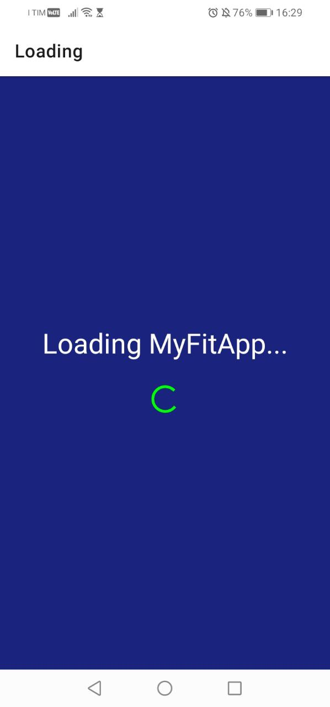
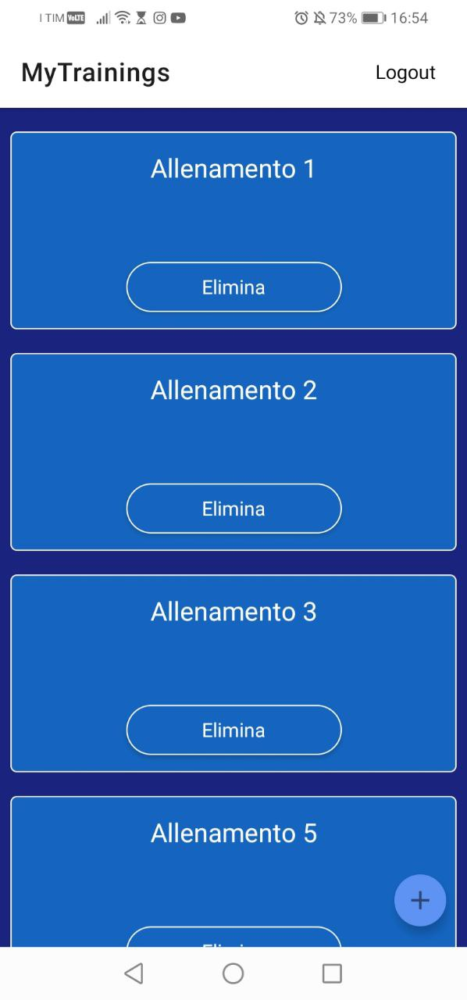

# MyFitApp
This is an university project made with React Native and Expo.  

---
# How does the app work:
The idea was to let user who workout, creating, updating, deleting, reading workouts.  
Essentially the user can do CRUD operations.  

---
# App Screens:
---
## Loading:
The Loading screen is used to try to fetch email and password from the local  
storage. If it fails, then switch to the Login screen.  

---
## Login:
The Login screen is used to sign in or sign up.  
I've used **Firebase** for the authentication and registration of the users.  
Once the user enters, an alert message appear and asks to memorize  
the email and pwd on the **local storage**.  
For the local storage i've used **expo-secure-store** which provides a way to  
encrypt and securely store key-value pairs locally on the device.  

---
---

---
## MyTrainings:
The MyTrainings screen is used to show all the workouts the uses added.  
With a click on the workout card we can enter in WorkoutDetails screen where  
the user can see all the days and exercises of the workout.  
If click on **Elimina** the workout is deleted.  
Up on the right there is a button with **Logout** text.  
It's used to logout and delete the key-value pairs stored locally on the device.
There's also a FAB button where user can navigate into AddWorkout screen.

---
## WorkoutDetails:
WorkoutDetails lets the user to see all the details and also to edit a specific  
day of the workout if the user wants to.  
